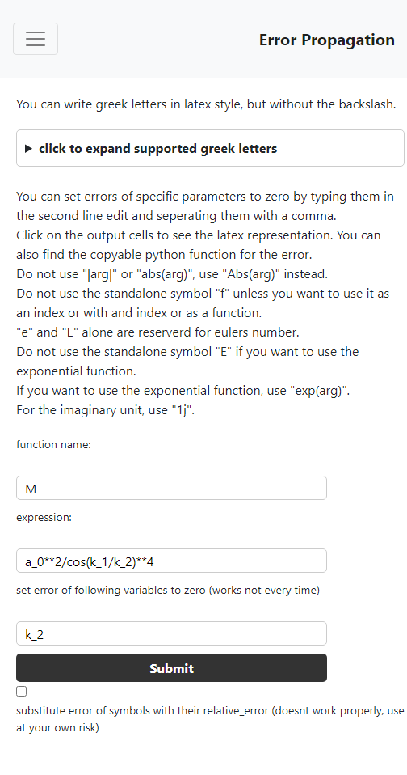
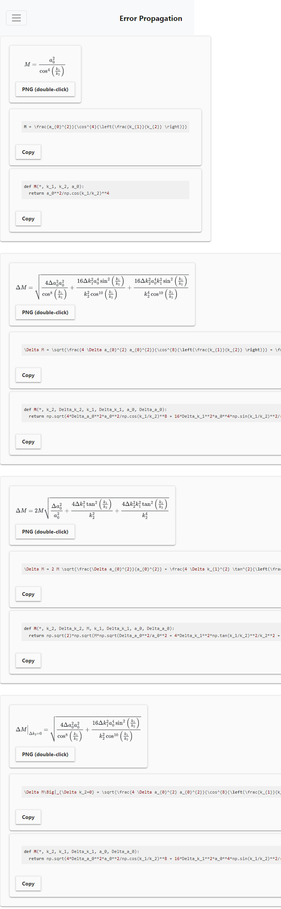

# Error Propagation usage:

- Run app.py and go to "Home" tab to enter an expression.
- Demos are provided in the "Demos" tab

## How to build and run the docker container

1. `git clone ...`
2. `docker build -t errorpropagation .`
3. `docker run --rm -it -p 5000:5000 errorpropagation`

Leave the terminal open and open specified web address, eg http://localhost:5000

